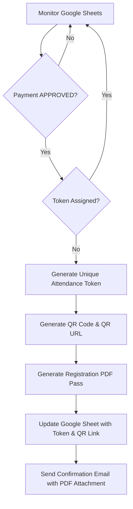
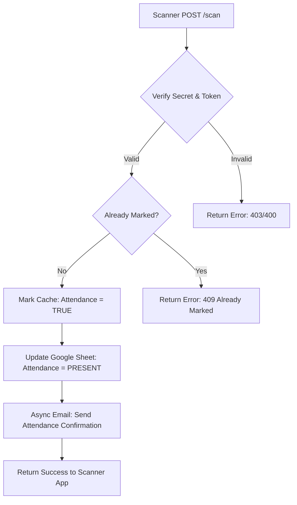
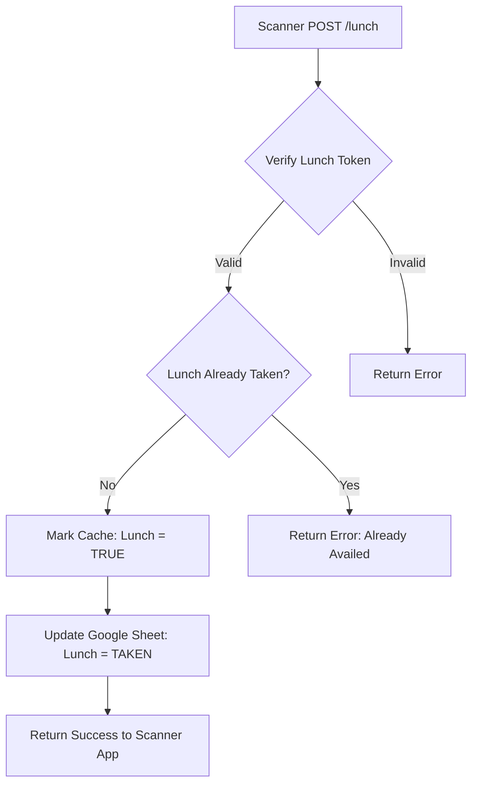

# Texperia 2026 Backend Workflow

This document outlines the core operational workflows of the Texperia 2026 backend system, covering payment processing, attendance marking, and lunch tracking.

## 1. Registration & Payment Workflow
This workflow is managed by the `paymentProcessor` and runs periodically to bridge the gap between registration forms and the event system.

### Key Steps:
1. **Detection**: The system scans CS and NCS sheets for approved registrations.
2. **Tokenization**: A unique 8-character ID is generated with a prefix (e.g., `CS--` or `NCS--`).
3. **Persistance**: Tokens are written to the sheet immediately to prevent duplicate processing.
4. **Communication**: The student receives their pass via email.

---

## 2. Attendance Scan Workflow
Triggered when an organizer scans a student's registration QR code.

### Key Steps:
1. **Verification**: Checks the `TEX-2026-SECURE` secret and token validity.
2. **Concurrency**: Uses an in-memory cache for sub-millisecond status checks.
3. **Confirmation**: A simplified email is sent to the participant confirming their arrival.

---

## 3. Lunch Scan Workflow
Triggered at the food counter when a lunch token is scanned.

### Key Steps:
1. **Redirection**: If a lunch token is accidentally scanned at the attendance endpoint, the system automatically redirects it to the lunch handler.
2. **Exclusivity**: Ensures lunch can only be marked once per token.

---

## 4. Cache Management
To ensure high performance (responses under 1s), the system uses a warming mechanism.

- **Startup**: At server start, `warmUpCache()` fetches all tokens from all sheets.
- **Refresh**: Every 30 seconds (configured), the cache refreshes to include newly approved students.
- **Persistence**: A local `sheet_metadata_cache.json` tracks sheet tabs and headers to avoid repetitive discovery phase.
